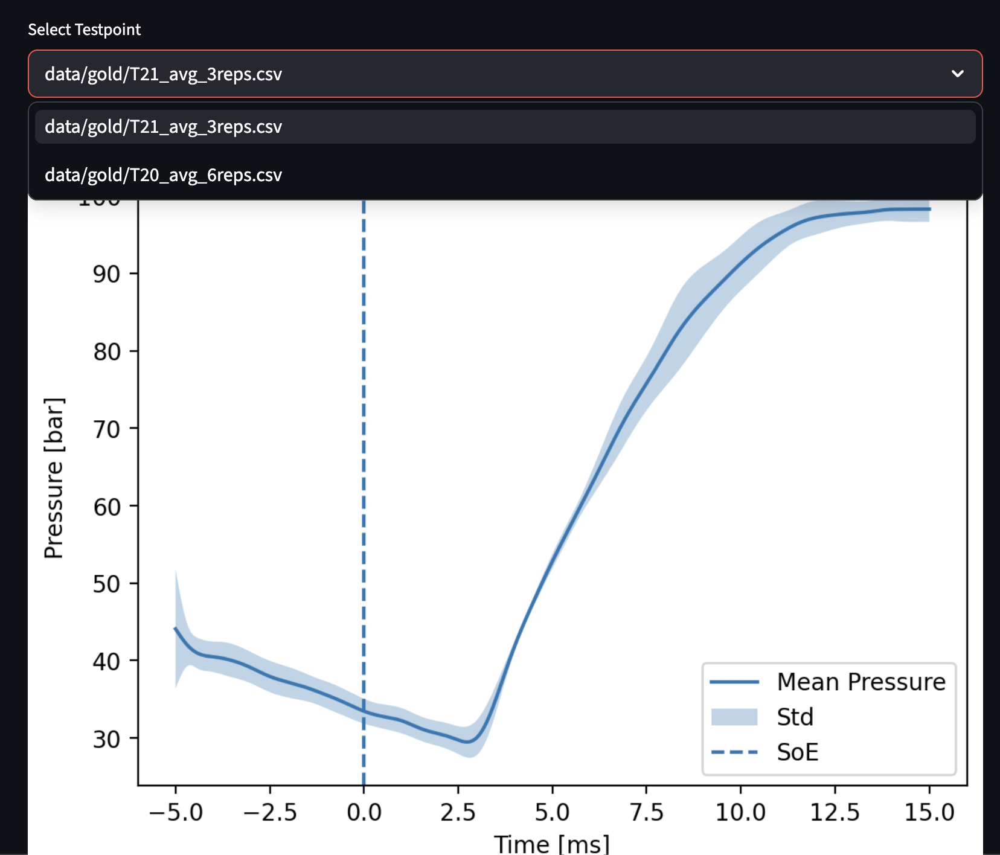
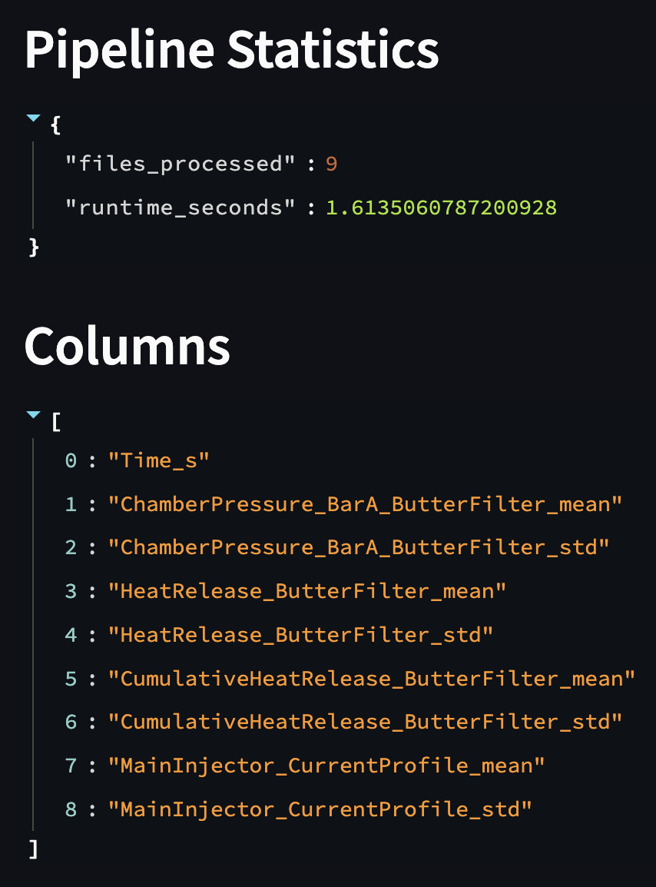
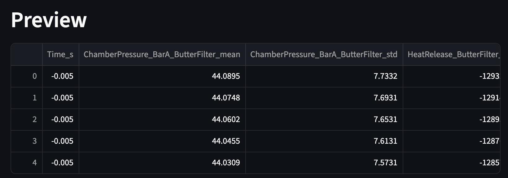

# Data Lineage

This document describes how raw combustion measurement data flows through the data pipeline and is transformed into usable data products.

The pipeline follows a **Medallion Architecture** consisting of Bronze, Silver, and Gold layers.

---

# Pipeline Data Flow 

Raw experimental data is progressively transformed through the following stages:
Bronze --> Silver --> Gold --> Data Products

---

# Bronze Layer - Raw Data

The **Bronze layer** contains the original experimental data collected from combustion measurements. 

Location: `data/bronze/`

Purpose:
- Preserve the original experimentall measurements
- Allow reproducibility of the pipeline

Characteristics: 
- Raw `.csv` files from engine experiments
- No transformations applied
- Data is stored exactly as acquired
- Each file represents a single measurement repetition

Example files:
- `T20_0001_SoE_-5ms_to_+15ms.csv`
- `T20_0002_SoE_-5ms_to_+15ms.csv`
- `T21_0001_SoE_-5ms_to_+15ms.csv`

TXX: stands for the tespoint, each testpoint is carried out with different conditions in the combustion chamber

_000X: stands for the repetition of this testpoint, each test has 3-6 repetitions

SoE = Start of Energizing, when the fuel injector recieves current and is activated. 

_SoE_-5ms_to_+15ms: Means that the data in the lab was cut between -5ms before injection started to +15 ms after injection, this can be verified by the `MainInjector_CurrentProfile`signal which spikes at Time_s = 0

---

# Silver Layer - Cleaned validated and Processed Data

The **Silver layer** contains validated and processed data from the Bronze layer.

Location: `data/silver/`

Purpose: 
- Produce reliable, clean signals
- Prepare data for aggregation and analysis

Processing steps:
1. Schema validation (required columns verified)
2. Missing value handling
3. Signal filtering of chamber pressure using a Butterworth filter
4. Calculation of Heat release and cumulative heat release

New columns added:
- `ChamberPressure_BarA_ButterFilter`
- `Derivate_filtered_pressure`
- `HeatRelease_ButterFilter`
- `CumulativeHeatRelease_ButterFilter`

These values are calculated using the filtered pressure signal.

---

# Gold Layer – Aggregated Analytical Data

The **Gold layer** contains aggregated datasets created from multiple repetitions of the same testpoint.

Location: data/gold/

Purpose:
- Provide high-quality analytical datasets
- Support visualization, machine learning, and API access

Each dataset includes:
- Mean pressure curve
- Standard deviation of pressure (betweeen repetitions)
- Mean heat release
- Standard deviation of heat release (between repetitions)
- Mean cumulative heat release
- Standard deviation of cumulative heat release (reps)

Example datasets:
- `T20_avg_6reps.csv`
- `T21_avg_3reps.csv`

--- 

# Data Products
The processed Gold datasets are used to generate multiple **data products**.

---

# Visualization Dashboard

The project includes an **interactive dashboard** implemented with **Streamlit**.

Run the dashboard with the command:
`streamlit run src/dashboard.py`

The dashboard provides:
- Interactive visualization of pressure curves (select testpoint)
- Mean and std plots
- Pipeline statistics
- Metadata inspection
- Preveiew of Gold layer datasets

Example dashboard views:

Dashboard Interface:

Pipeline statistics:

Gold dataset preview:

---

# REST API

A REST API provides external access to the processed datasets.

Run the API server:
`uvicorn src.api:app --reload`

Example routes:

### List available testpoints
`GET /testpoints`

Response example: 
[
"T21_avg_3reps",
"T20_avg_6reps"
]

---

### Retrieve pressure data for a testpoint
`GET /pressure/T20_avg_6reps`

Returns the full Gold dataset for the selected testpoint.

---

### Pipeline statistics

`GET /stats`

Example response:

{
"files_processed": 9,
"runtime_seconds": 1.61
}

---

# Machine Learning Model

The pipeline includes a simple machine learning component implemented using **linear regression**.

Purpose:
- Predict **peak combustion pressure** based on processed datasets.

Training process:

1. Gold datasets are loaded
2. Peak pressure is extracted
3. A linear regression model is trained to estimate combustion characteristics

Although simple, this demonstrates how machine learning can be integrated into this data pipeline for predictive analytics.

---

